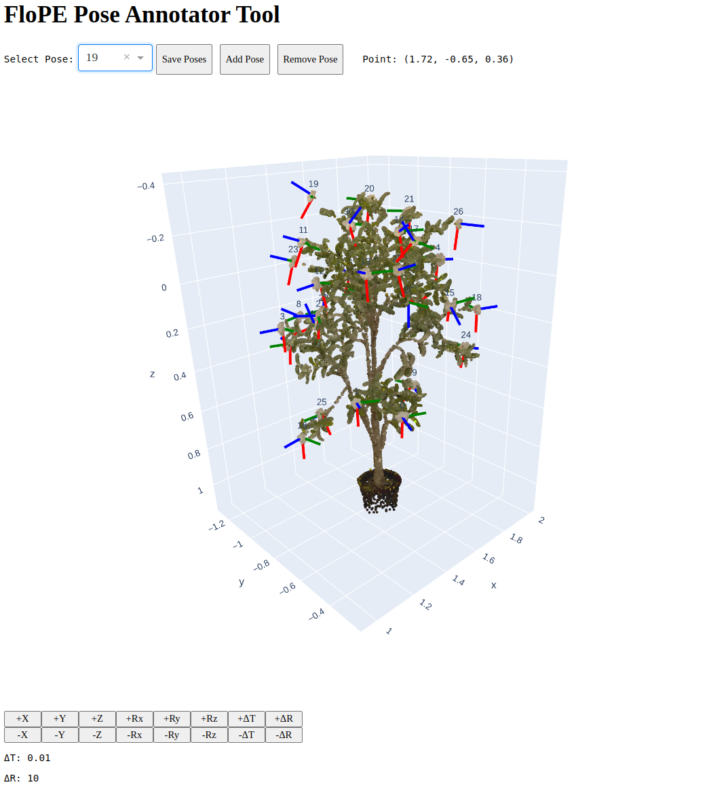

# 🌻FloPE: Flower Pose Estimation for Precision Pollination

[Project Page](https://wvu-irl.github.io/flope-irl/)   |   [Paper](https://arxiv.org/pdf/2503.11692)   |   [arXiv](https://arxiv.org/abs/2503.11692)   |   [Video](https://www.youtube.com/watch?v=7FnDFMThjGs)   |   [Data](https://github.com/wvu-irl/flope/releases/tag/release1)

# FloPE Pose Annotator Tool

<p align="center">
    
</p>

# BibTex

```
@article{shrestha2025flope,
  title={FloPE: Flower Pose Estimation for Precision Pollination},
  author={Shrestha, Rashik and Rijal, Madhav and Smith, Trevor and Gu, Yu},
  journal={arXiv preprint arXiv:2503.11692},
  year={2025}
}
```
