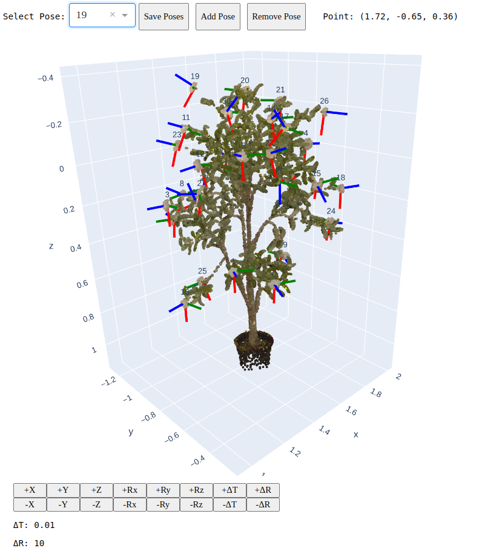

<h1 align="center">🌻 FloPE: Flower Pose Estimation for Precision Pollination</h1>

<p align="center">
  <a href="https://wvu-irl.github.io/flope-irl/" target="_blank">
    
  </a>
  <a href="https://arxiv.org/pdf/2503.11692" target="_blank">
    
  </a>
  <a href="https://arxiv.org/abs/2503.11692" target="_blank">
    
  </a>
  <a href="https://www.youtube.com/watch?v=7FnDFMThjGs" target="_blank">
    
  </a>
  <a href="https://wvu-irl.github.io/flope-irl/static/images/flope_poster.png" target="_blank">
    
  </a>
  <a href="https://github.com/wvu-irl/flope/releases/tag/release1" target="_blank">
    
  </a>
</p>

# FloPE Pose Annotator Tool

<p align="left">
    
</p>

# BibTex

```
@article{shrestha2025flope,
  title={FloPE: Flower Pose Estimation for Precision Pollination},
  author={Shrestha, Rashik and Rijal, Madhav and Smith, Trevor and Gu, Yu},
  journal={arXiv preprint arXiv:2503.11692},
  year={2025}
}
```
